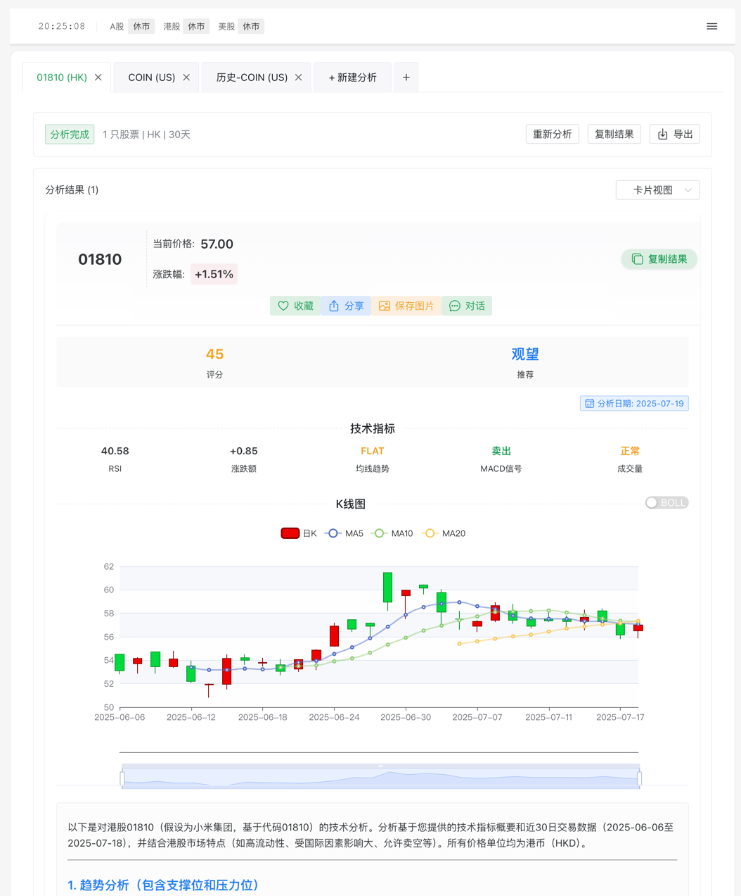

# 股票分析系统 (Stock Analysis System)

## 简介

基于 https://github.com/DR-lin-eng/stock-scanner ( lanzhihong6/stock-scanner ) 二次修改，感谢原作者  

## 镜像版本和说明

| 版本（docker tag） | 变更内容 |
| --- | --- |
| 0.2.1-SNAPSHOT | 记录分析历史，可直接从历史中恢复分析结果 |
| 0.2.0-SNAPSHOT | 增加用户系统，配置 后默认用demo/demo登陆 |
| 0.1.2 | 增加K线/布林带；支持截图分享 |

说明：
1. -SNAPSHOT 是测试版，不会打到latest。
2. 数据库默认在data/stock_scanner.db目录下，默认建议启用用户(ENABLE_USER_SYSTEM=true)。目前SNAPSHOT阶段不保证数据库平滑迁移。

## Docker镜像一键部署

> [!NOTE]
> 对于在 **Synology NAS** 等特定设备上的部署，请参考我们的 [Synology NAS 部署指南](./docs/README.synology.md)。



```
# 拉取最新版本
docker pull heyfluke/stock-scanner:latest

# 启动主应用容器
docker run -d \
  --name stock-scanner-app \
  --network stock-scanner-network \
  -p 8888:8888 \
  -v "$(pwd)/logs:/app/logs" \
  -v "$(pwd)/data:/app/data" \
  -e API_KEY="你的API密钥" \
  -e API_URL="你的API地址" \
  -e API_MODEL="你的API模型" \
  -e API_TIMEOUT="60" \
  -e ANNOUNCEMENT_TEXT="你的公告内容" \
  --restart unless-stopped \
  heyfluke/stock-scanner:latest
  
# 运行Nginx容器
docker run -d \
  --name stock-scanner-nginx \
  --network stock-scanner-network \
  -p 80:80 \
  -p 443:443 \
  -v "$(pwd)/nginx/nginx.conf:/etc/nginx/conf.d/default.conf" \
  -v "$(pwd)/nginx/logs:/var/log/nginx" \
  -v "$(pwd)/nginx/ssl:/etc/nginx/ssl" \
  --restart unless-stopped \
  nginx:stable-alpine

针对API_URL处理兼容更多的api地址，规则与Cherry Studio一致， /结尾忽略v1版本，#结尾强制使用输入地址。
API_URL 处理逻辑说明：
1. 当 API_URL 以 / 结尾时直接追加 chat/completions，保留原有版本号：
  示例：
   输入: https://ark.cn-beijing.volces.com/api/v3/
   输出: https://ark.cn-beijing.volces.com/api/v3/chat/completions
2. 当 API_URL 以 # 结尾时强制使用当前链接：
  示例：
   输入: https://ark.cn-beijing.volces.com/api/v3/chat/completions#
   输出: https://ark.cn-beijing.volces.com/api/v3/chat/completions
3. 当 API_URL 不以 / 结尾时使用默认版本号 v1：
  示例：
   输入: https://ark.cn-beijing.volces.com/api
   输出: https://ark.cn-beijing.volces.com/api/v1/chat/completions


```

默认8888端口，部署完成后访问  http://你的域名或ip:8888 即可使用  

## 使用Nginx反向代理

项目已集成Nginx服务，可以通过80端口(HTTP)和443端口(HTTPS)访问应用  
使用docker-compose启动：  

```shell
# 克隆仓库
git clone https://github.com/heyfluke/stock-scanner.git
cd stock-scanner

# 创建.env文件并填写必要的环境变量
cat > .env << EOL
API_KEY=你的API密钥
API_URL=你的API地址
API_MODEL=你的API模型
API_TIMEOUT=超时时间(默认60秒)
ANNOUNCEMENT_TEXT=公告文本
EOL

# 请注意API_URL要有`/`结尾，例如：API_URL=https://dashscope.aliyuncs.com/compatible-mode/v1/

# 创建SSL证书目录
mkdir -p nginx/ssl

# 生成自签名SSL证书（仅用于测试环境）
openssl req -x509 -nodes -days 365 \
  -newkey rsa:2048 \
  -keyout nginx/ssl/privkey.pem \
  -out nginx/ssl/fullchain.pem \
  -subj "/CN=localhost" \
  -addext "subjectAltName=DNS:localhost,IP:127.0.0.1"

# 启动服务
docker-compose up -d
```

### 使用自己的SSL证书

如果您有自己的SSL证书，可以替换自签名证书：

1. 将您的证书文件放在 `nginx/ssl/` 目录下
2. 确保证书文件命名为 `fullchain.pem`，私钥文件命名为 `privkey.pem`
3. 重启服务: `docker-compose restart nginx`

相关参考：[免费泛域名 SSL 证书申请及自动续期（使用 1Panel 面板）](https://bronya-zaychik.cn/archives/GenSSL.html)

## Github Actions 部署

| 环境变量 | 说明 |
| --- | --- |
| DOCKERHUB_USERNAME | Docker Hub用户名 |
| DOCKERHUB_TOKEN | Docker Hub访问令牌 |
| SERVER_HOST | 部署服务器地址 |
| SERVER_USERNAME | 服务器用户名 |
| SSH_PRIVATE_KEY | SSH私钥 |
| DEPLOY_PATH | 部署路径 |
| SLACK_WEBHOOK | Slack通知Webhook（可选） |


## 注意事项 (Notes)
- 股票分析仅供参考，不构成投资建议
- 使用前请确保网络连接正常
- 建议在实盘前充分测试

## 贡献 (Contributing)
欢迎提交 issues 和 pull requests！

## 许可证 (License)
[待添加具体许可证信息]

## 免责声明 (Disclaimer)
本系统仅用于学习和研究目的，投资有风险，入市需谨慎。
